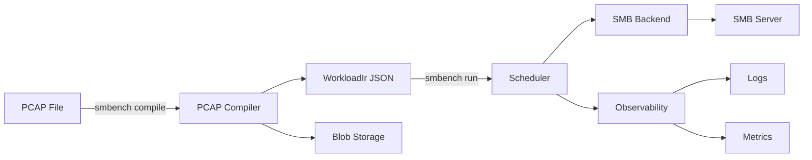
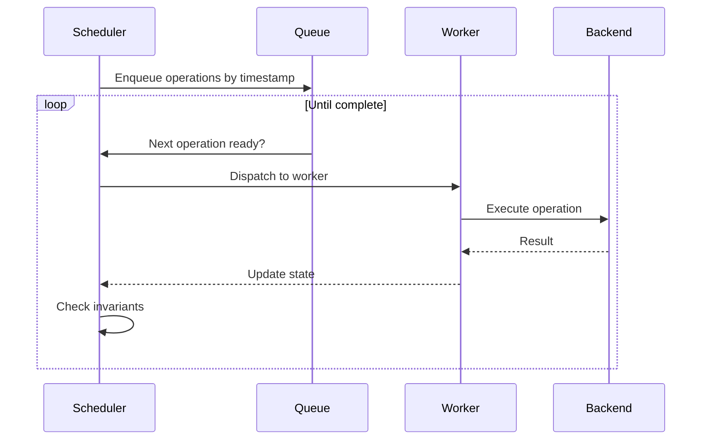
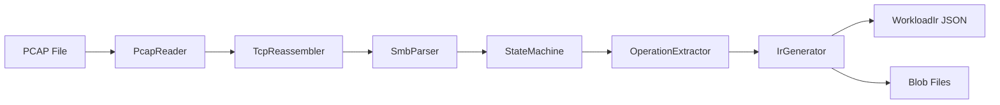

# SMBench Architecture: Current Implementation (v1.3.0)

**Status:** PRIMARY ARCHITECTURE DOCUMENT  
**Last Updated:** 2026-02-07  
**Implementation:** Rust-only, smb-rs backend, PCAP compiler

---

## Table of Contents

1. [Overview](#overview)
2. [System Architecture](#system-architecture)
3. [Core Components](#core-components)
4. [IR Schema](#ir-schema)
5. [Scheduler Design](#scheduler-design)
6. [Backend Abstraction](#backend-abstraction)
7. [PCAP Compiler](#pcap-compiler)
8. [Testing Strategy](#testing-strategy)
9. [Future Roadmap](#future-roadmap)

---

## Overview

SMBench is a high-fidelity SMB workload replay system implemented in Rust. It enables:

- **Bug Reproduction:** Capture customer workloads → Compile PCAP → Replay in lab → Reproduce issues
- **Load Testing:** Scale to thousands of concurrent users with realistic timing
- **Protocol Validation:** Test SMB2/3 feature compliance against real servers

### Current Capabilities

**Implemented:**
- PCAP compiler (`smbench compile`) with TCP reassembly, SMB2/3 parsing, and blob storage
- Rust-based IR (Intermediate Representation) schema
- Event-driven scheduler with per-client ordering
- smb-rs backend with full SMB3 protocol support
- Comprehensive test suite (80+ tests)
- CLI tool (`smbench compile`, `smbench run`, `smbench validate`)

**Not Yet Implemented:**
- Provisioning tools (AD/LDAP integration)
- Path/user mapping for customer to lab translation
- Analysis tools for PCAP comparison

---

## System Architecture



### Data Flow

1. **Input:** PCAP file compiled via `smbench compile`, or manually created WorkloadIr JSON
2. **Compiler:** Reads PCAP, reassembles TCP, parses SMB2/3, extracts operations, writes IR + blobs
3. **Scheduler:** Reads IR, schedules operations with timing fidelity
4. **Backend:** Executes SMB operations via smb-rs
5. **Observability:** Logs operations, collects metrics
6. **Output:** Execution results, timing data, error reports

---

## Core Components

### 1. IR (Intermediate Representation)

**Location:** `src/ir/mod.rs`

The IR is a JSON-based format that describes SMB workloads:

```rust
pub struct WorkloadIr {
    pub version: u32,
    pub metadata: Metadata,
    pub clients: Vec<ClientSpec>,
    pub operations: Vec<Operation>,
}
```

**Key Features:**
- Client-centric: Operations grouped by client_id
- Timestamp-based: Microsecond precision for timing
- Extensible: JSON extensions for SMB-specific features
- Blob references: External files for read/write data

**Supported Operations:**
- `Open` - File/directory open with create options
- `Close` - Close handle
- `Read` - Read data from file
- `Write` - Write data to file (with content-addressed blob)
- `Delete` - Delete file/directory
- `Rename` - Rename file/directory

### 2. Scheduler

**Location:** `src/scheduler/mod.rs`

Event-driven scheduler that replays operations with timing fidelity.

**Key Features:**
- **Per-client ordering:** Operations from same client execute in order
- **Cross-client parallelism:** Different clients run concurrently
- **Time scaling:** Configurable time_scale for faster/slower replay
- **Invariant checking:** Detects handle leaks, ordering violations
- **Watchdog:** Monitors for stuck operations

**Configuration:**

```rust
pub struct SchedulerConfig {
    pub max_concurrent: usize,      // Max concurrent operations
    pub time_scale: f64,            // Time scaling factor (0.1 = 10x faster)
    pub worker_count: usize,        // Worker threads
    pub backend_mode: BackendMode,  // Development vs Production
    pub invariant_mode: InvariantMode, // Panic vs LogAndContinue
    pub debug_dump_on_error: bool,  // Dump state on error
    pub watchdog_interval: Duration, // Watchdog check interval
    pub inflight_timeout: Duration,  // Max operation duration
}
```

**Invariants:**
- No handle leaks (all Opens have matching Closes)
- Per-client operation ordering preserved
- No operations on closed handles
- Timestamps monotonically increasing per client

### 3. Backend Abstraction

**Location:** `src/backend/mod.rs`

Trait-based abstraction for SMB backends:

```rust
#[async_trait]
pub trait SMBBackend: Send + Sync {
    async fn execute_operation(
        &self,
        client_id: &str,
        operation: &Operation,
        state: &mut ClientState,
    ) -> Result<OperationResult>;
}
```

**Implementations:**
- **smb-rs:** Full SMB2/3 protocol (current)

### 4. smb-rs Backend

**Location:** `src/backend/smbrs.rs`

Rust-native SMB2/3 client implementation.

**Features:**
- SMB 3.1.1 with encryption
- Oplocks & Leases
- Durable handles
- Multichannel support
- RDMA transport (optional)
- Comprehensive FSCTL/IOCTL support

**Connection Management:**
- Per-client connection pooling
- Automatic reconnection
- Lease break handling
- Session multiplexing

**Extensions Supported:**

```json
{
  "oplock_level": "Batch",
  "lease_state": {"read_caching": true, "write_caching": true},
  "create_disposition": "OpenIf",
  "file_attributes": {"hidden": true, "archive": true},
  "share_access": {"read": true, "write": false},
  "create_options": {"delete_on_close": true},
  "durable_handle": true
}
```

---

## IR Schema

### WorkloadIr Structure

```json
{
  "version": 1,
  "metadata": {
    "source": "pcap_compiler",
    "duration_seconds": 120.5,
    "client_count": 100
  },
  "clients": [
    {
      "client_id": "10.0.0.1",
      "operation_count": 1500
    }
  ],
  "operations": [
    {
      "type": "Open",
      "op_id": "op_1",
      "client_id": "10.0.0.1",
      "timestamp_us": 1000000,
      "path": "file.txt",
      "mode": "ReadWrite",
      "handle_ref": "h_1",
      "extensions": {
        "create_disposition": 2
      }
    }
  ]
}
```

### Operation Types

#### Open

```json
{
  "type": "Open",
  "path": "path/to/file",
  "mode": "Read | Write | ReadWrite",
  "handle_ref": "h_1",
  "extensions": {
    "create_disposition": 2,
    "oplock_level": 8
  }
}
```

#### Write

```json
{
  "type": "Write",
  "handle_ref": "h_1",
  "offset": 0,
  "length": 4096,
  "blob_path": "blobs/a1b2c3d4e5f6.bin"
}
```

---

## Scheduler Design

### Event Loop



### Timing Model

**Absolute Timestamps:**
- Operations have absolute timestamps (microseconds since workload start)
- Scheduler waits until timestamp before dispatching
- Time scaling applied: `actual_wait = (target_ts - current_ts) * time_scale`

**Per-Client Ordering:**
- Operations from same client execute in timestamp order
- Next operation waits for previous to complete
- Cross-client operations run in parallel

**Example:**

```
Client A: Open(t=0) -> Write(t=100ms) -> Close(t=200ms)
Client B: Open(t=50ms) -> Read(t=150ms) -> Close(t=250ms)

Execution timeline:
t=0:    Client A Open starts
t=50ms: Client B Open starts (parallel)
t=100ms: Client A Write starts (after Open completes)
t=150ms: Client B Read starts (after Open completes)
...
```

### Invariant Checking

**Handle Leak Detection:**
```rust
// At workload end, all handles must be closed
assert!(state.open_handles.is_empty(), "Handle leak detected");
```

**Ordering Validation:**
```rust
// Per-client timestamps must be monotonic
assert!(op.timestamp_us >= last_timestamp, "Timestamp ordering violation");
```

**State Consistency:**
```rust
// Can't operate on closed handle
assert!(state.handles.contains_key(&handle_ref), "Handle not found");
```

---

## Backend Abstraction

### SMBBackend Trait

```rust
#[async_trait]
pub trait SMBBackend: Send + Sync {
    /// Execute a single operation
    async fn execute_operation(
        &self,
        client_id: &str,
        operation: &Operation,
        state: &mut ClientState,
    ) -> Result<OperationResult>;
}
```

### ClientState

```rust
pub struct ClientState {
    pub handles: HashMap<String, HandleInfo>,
    pub connection: Option<BackendConnection>,
    pub last_operation_time: Option<Instant>,
}

pub struct HandleInfo {
    pub path: String,
    pub mode: OpenMode,
    pub backend_handle: Box<dyn Any + Send>,
}
```

### Error Handling

```rust
pub enum BackendError {
    ConnectionFailed(String),
    OperationFailed { op_id: String, error: String },
    InvalidHandle(String),
    ProtocolError(String),
}
```

---

## PCAP Compiler

**Location:** `src/compiler/`  
**Feature flag:** `pcap-compiler`

The PCAP compiler extracts SMB2/3 operations from packet captures and generates
WorkloadIr JSON with content-addressed blob files.

### Pipeline



### Components

| Component | File | Description |
|-----------|------|-------------|
| **PcapReader** | `pcap_reader.rs` | Streams packets from PCAP files using `pcap-parser`. Handles Legacy PCAP format. |
| **TcpReassembler** | `tcp_reassembly.rs` | Parses Ethernet/IPv4/IPv6/TCP headers, reassembles streams in sequence order, handles out-of-order packets and retransmissions. Filters for TCP port 445 (SMB). |
| **SmbParser** | `smb_parser.rs` | `nom`-based parser for SMB2/3 messages. Parses 64-byte headers per [MS-SMB2 2.2.1] and command payloads for CREATE, CLOSE, READ, WRITE, IOCTL, SET_INFO, TREE_CONNECT, and more. Handles compound requests. |
| **SmbStateMachine** | `state_machine.rs` | Tracks sessions, trees, and open files. Pairs requests with responses by message_id. Generates unique handle references. Per [MS-SMB2 Section 3]. |
| **OperationExtractor** | `operation_extractor.rs` | Converts tracked operations to IR. Infers `OpenMode` from DesiredAccess mask. Extracts oplock/disposition metadata as extensions. |
| **IrGenerator** | `ir_generator.rs` | Writes WorkloadIr JSON and content-addressed blob files. Uses BLAKE3 hashing for automatic deduplication. |

### Key Design Decisions

- **Stream merging:** Both TCP directions (client-to-server requests and server-to-client responses) are merged and sorted by `(message_id, is_response)` before state machine processing, ensuring correct request/response pairing.
- **Content-addressed blobs:** Write data is hashed with BLAKE3 and stored in `blobs/{hash}.bin`. Identical writes across the capture share the same blob file.
- **Multi-client support:** Each client IP is tracked independently. The compiler produces per-client operation sequences with proper handle references.

### CLI Usage

```bash
smbench compile <pcap-file> [OPTIONS]
  -o, --output <DIR>        Output directory (default: output)
  --filter-client <IP>      Filter by client IP
  --filter-share <NAME>     Filter by share name
  --anonymize               Anonymize IPs/paths
  -v, --verbose             Verbose output
```

### References

- [MS-SMB2 2.2.1] SMB2 Packet Header
- [MS-SMB2 2.2.13] CREATE Request
- [MS-SMB2 2.2.14] CREATE Response
- [MS-SMB2 2.2.19] READ Request
- [MS-SMB2 2.2.21] WRITE Request
- [MS-SMB2 2.2.39] SET_INFO Request
- [MS-FSCC 2.4.34.2] FileRenameInformation
- [RFC 793] TCP

---

## Testing Strategy

### Test Pyramid

```
                    /\
                   /  \
                  / E2E \          2 E2E tests + 3 use case tests
                 /______\
                /        \
               / Integration \     45 smb-rs + 11 compiler tests
              /______________\
             /                \
            /   Unit Tests      \  26 unit tests (in src/)
           /____________________\
```

### Test Categories

#### 1. Unit Tests (src/)
- IR parsing/serialization
- Scheduler logic
- Backend abstraction
- PCAP compiler components (parser, reassembly, state machine, extractor, generator)

#### 2. Integration Tests (tests/)

**smb_rs_validation.rs** (45 tests):
- Basic operations (open, read, write, close)
- Oplocks & leases
- FSCTL operations (DFS, snapshots, offload, hashing)
- IPC operations (share enumeration, network interfaces)
- Multichannel capabilities
- Directory operations
- File/FS info queries

**compiler_tests.rs** (11 tests):
- PCAP reading and packet streaming
- TCP reassembly (in-order, out-of-order, filtering)
- SMB message parsing
- State machine operation tracking
- Operation extraction with type verification
- Full pipeline (PCAP to IR) for single and multi-client
- Blob storage and deduplication

**e2e_pcap_to_replay.rs** (2 tests):
- End-to-end single-client compile and validate
- End-to-end multi-client compile and validate

**backend_mode.rs:**
- Development vs Production mode behavior

**scheduler_invariant.rs:**
- Handle leak detection
- Ordering validation

**timing_precision.rs:**
- Scheduler timing accuracy

#### 3. Use Case Tests (tests/)

**use_case_bug_reproduction.rs:**
- Oplock break race condition
- Multi-client write ordering
- Durable handle reconnection

**use_case_load_testing.rs:**
- 100-user scaled workload
- Sustained load (1 hour)

**protocol_fidelity.rs:**
- Oplock levels (None, Level2, Exclusive, Batch)
- Lease states (R, W, H, RW, RH, RWH)
- Create dispositions
- File attributes

### Running Tests

```bash
# All tests (non-SMB)
cargo test

# PCAP compiler tests
cargo test --features pcap-compiler

# SMB backend tests (requires server)
export SMBENCH_SMB_SERVER=10.10.10.79
export SMBENCH_SMB_SHARE=testshare
export SMBENCH_SMB_USER=testuser
export SMBENCH_SMB_PASS=testpass

cargo test --features smb-rs-backend

# Use case tests (ignored by default)
cargo test --features smb-rs-backend -- --ignored

# Specific test
cargo test --features smb-rs-backend test_oplock_break_race_condition -- --ignored
```

---

## Future Roadmap

### Provisioning Tools

**Goal:** Automate test environment setup

- AD/LDAP user creation
- Directory structure provisioning
- Permission assignment
- Path mapping (customer to lab)

### Analysis Tools

**Goal:** Compare replay results to original PCAP

- Timing analysis (latency distribution)
- Operation success/failure comparison
- Protocol compliance validation
- Performance regression detection

---

## References

### Microsoft Specifications

- **[MS-SMB2]** Server Message Block (SMB) Protocol Versions 2 and 3
  https://learn.microsoft.com/en-us/openspecs/windows_protocols/ms-smb2/
- **[MS-FSCC]** File System Control Codes
  https://learn.microsoft.com/en-us/openspecs/windows_protocols/ms-fscc/
- **[MS-PCCRC]** Peer Content Caching and Retrieval: Content Identification
  https://learn.microsoft.com/en-us/openspecs/windows_protocols/ms-pccrc/

### Other

- **[RFC 793]** Transmission Control Protocol
- **smb-rs:** https://github.com/avivnaaman/smb-rs
- **problem-definition.md:** Original requirements and use cases

---

## Appendix: CLI Usage

### Compile Command

```bash
smbench compile <PCAP_FILE> [OPTIONS]

Options:
  -o, --output <DIR>        Output directory (default: output)
  --filter-client <IP>      Only include traffic from/to this client IP
  --filter-share <NAME>     Only include traffic for this share
  --anonymize               Anonymize IPs and paths
  -v, --verbose             Verbose logging
```

### Run Command

```bash
smbench run <IR_FILE>
```

### Validate Command

```bash
smbench validate <IR_FILE>
```

### Legacy Mode

```bash
smbench --ir <IR_FILE> [OPTIONS]

Options:
  --backend <smb-rs>        Backend implementation
  --time-scale <SCALE>      Time scaling factor (default: 1.0)
  --workers <N>             Worker threads (default: 4)
  --max-concurrent <N>      Max concurrent operations (default: 64)
  --validate-only           Validate IR without executing
  --dry-run                 Validate and print summary
```

### Example Workflow

```bash
# Compile PCAP to IR
smbench compile customer.pcap -o workload/

# Validate the generated IR
smbench validate workload/workload.json

# Replay (requires smb-rs-backend feature and env vars)
smbench run workload/workload.json
```

---

**End of Document**
